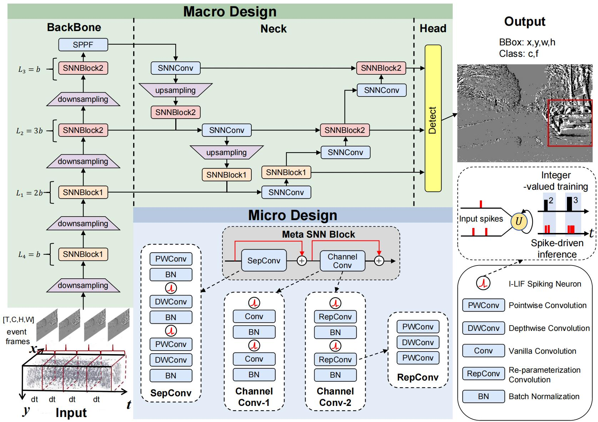

# Integer-Valued Training and Spike-Driven Inference Spiking Neural Network for High-performance and Energy-efficient Object Detection (ECCV2024 Best Paper Candidate)

[Xinhao Luo](), [Man Yao](https://scholar.google.com/citations?user=eE4vvp0AAAAJ), [Yuhong Chou](https://scholar.google.com.hk/citations?hl=zh-CN&user=8CpWM4cAAAAJ), [Bo Xu]() and [Guoqi Li](https://scholar.google.com/citations?user=qCfE--MAAAAJ&)

BICLab, Institute of Automation, Chinese Academy of Sciences

---

:rocket:  :rocket:  :rocket: **News**:

- **July. 1, 2024**: Accepted by ECCV2024.
- **September. 28, 2024**: Upload code.
- **October. 1, 2024**: Best Paper Candidate obtained.
- **October. 21, 2024**: Upload checkpoints.

checkpoint(23M, T=1, D=4):https://drive.google.com/drive/folders/1c5p09ZRCFeK1M5wH6zQduJltZalMzQkZ?usp=sharing

checkpoint(69M, T=1, D=4):https://drive.google.com/file/d/1rmcUMJztbjFFbbVqW8xwgshKNZel1psZ/view?usp=drive_link

checkpoint(23M, T=2, D=4，GEN1，based on Spikingjelly):
https://drive.google.com/file/d/1PnrsYWSOrCjvfRpYng_hsTcv35pGsrHb/view?usp=drive_link

## Abstract

Brain-inspired Spiking Neural Networks (SNNs) have bio-plausibility and low-power advantages over Artificial Neural Networks (ANNs). Applications of SNNs are currently limited to simple classification tasks because of their poor performance. In this work, we focus on bridging the performance gap between ANNs and SNNs on object detection. Our design revolves around network architecture and spiking neuron, include:(1)**SpikeYOLO**, We explore suitable architectures in SNNs for handling object detection tasks and propose SpikeYOLO, which simplifies YOLOv8 and incorporates meta SNN blocks. This inspires us that the complex modules in ANN may not be suitable for SNN architecture design. (2)**I-LIF Spiking Neuron**, We propose an I-LIF spiking neuron that combines integer-valued training with spike-driven inference. The former is used to reduce quantization errors in spiking neurons, and the latter is the basis of the low-power nature of SNNs. The proposed method achieves outstanding accuracy with low power consumption on object detection datasets, demonstrating the potential of SNNs in complex vision tasks. On the COCO dataset, we obtain **66.2%** mAP@50 and **48.9%** mAP@50:95, which is **+15.0%** and **+18.7%** higher than the prior state-of-the-art SNN, respectively. On the Gen1 dataset, SpikeYOLO is **+2.5%** better than ANN models with **5.7×** energy efficiency.

For help or issues using this git, please submit a GitHub issue.

For other communications related to this git, please contact `luoxinhao2023@ia.ac.cn` and `man.yao@ia.ac.cn`.

## train
python train.py

## test / get_firing_rate
python test.py

## notes
Since the Gen1 dataset involves different ways of data preprocessing, we implemented it in the folder "SpikeYOLO_for_Gen1".

## Thanks

Our implementation is mainly based on the following codebases. We gratefully thank the authors for their wonderful works.

https://github.com/ultralytics/ultralytics
